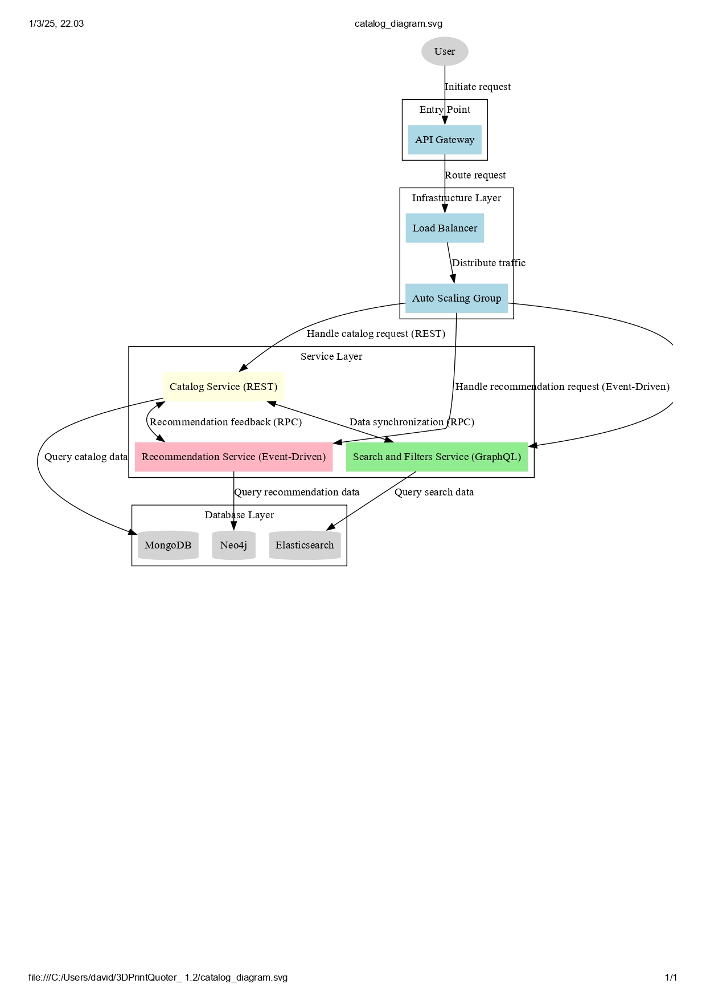

# 3D Print Catalog Microservices 🌐

     

## Overview 📋

The **3D Print Catalog Microservices** project is a scalable, microservices-based architecture designed to manage 3D printed products, including catalog, recommendations, and search functionalities. It leverages modern technologies like FastAPI, MongoDB, Neo4j, Elasticsearch, and Docker to provide a robust and efficient solution for 3D printing businesses.

This project focuses on 3D printed products with properties like category, name, material, object details, and price. It follows a layered architecture with an API Gateway, Load Balancer, Auto Scaling Group, and separate services for catalog management (REST), recommendations (Event-Driven), and search (GraphQL). See the architecture diagram below:

 <!-- Asegúrate de subir tu diagrama como un archivo PNG o similar -->

## Features 🚀

- **Catalog Management**: CRUD operations for 3D printed products using REST APIs (category, name, material, detail, price).
- **Recommendations**: Event-driven recommendations based on user preferences and 3D printing materials.
- **Search & Filters**: Advanced search capabilities using GraphQL and Elasticsearch for 3D products.
- **Scalability**: Auto-scaling and load balancing for high availability.
- **Testing**: Comprehensive unit and integration tests for all services.

## Technologies 🛠️

- **Backend**: Python 3.9+, FastAPI
- **Databases**: MongoDB for catalog data, Neo4j for relationships, Elasticsearch for search indexing
- **Containerization**: Docker
- **Infrastructure**: Terraform for cloud deployment
- **Testing**: pytest, unittest

## Getting Started 🏃‍♂️

### Prerequisites

- Python 3.9 or higher
- Docker and Docker Compose
- MongoDB, Neo4j, and Elasticsearch (or use Docker containers)

### Installation

1. Clone the repository:
   ```bash
   git clone https://github.com/your-username/3d-print-catalog.git
   cd 3d-print-catalog